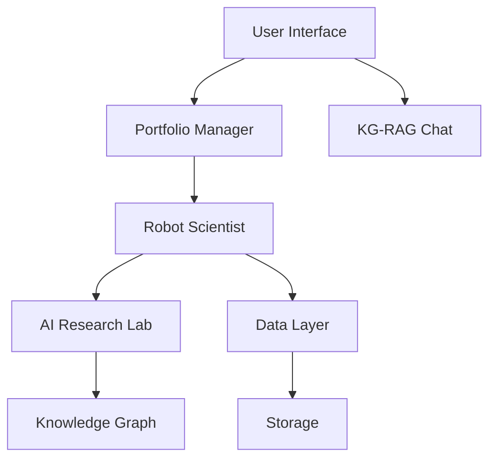

NeuralWealth: Autonomous Financial Scientist

🎯 Purpose

NeuralWealth is an advanced AI-driven financial advisory system that automates the entire investment research process. Unlike traditional robo-advisors that follow static rules, NeuralWealth functions as an autonomous "Robot Scientist" that generates, tests, and refines investment strategies using cutting-edge AI techniques including Large Language Models, Causal Reasoning, and Multi-Agent Reinforcement Learning.

Key Innovation: The system doesn't just predict market movements—it explains its reasoning using causal knowledge graphs, making complex financial strategies transparent and understandable.

🏗️ Architecture Overview

📦 Core Modules
1. 🤖 Robot Scientist Engine

Location: neuralwealth/ai_lab/

    Hypothesis Generation: LLM-powered strategy formulation with logical validation

    Multi-Agent System: Specialized agents for research, testing, and knowledge management

    Theorem Proving: Z3-based logical consistency checking for investment hypotheses

    Backtesting: Historical and synthetic crash scenario testing

2. 📊 Data Intelligence Layer

Location: neuralwealth/data_layer/

    Multi-Source Integration: Market data, news sentiment, macroeconomic indicators

    Causal Discovery: PC algorithm for identifying market relationships

    Synthetic Data Generation: FinDiff models for crash scenario simulation

    Real-time Processing: High-frequency data pipelines with InfluxDB storage

3. 💼 Portfolio Management

Location: neuralwealth/portfolio/

    Federated Optimization: Privacy-preserving personalized portfolio management

    CVaR Risk Management: Conditional Value-at-Risk constrained optimization

    Execution Engine: Broker integration with slippage-aware trading

    Risk Monitoring: Real-time constraint validation and compliance checking

4. 💬 Explainable AI Interface

Location: neuralwealth/ui/

    KG-RAG Chat: Knowledge Graph Retrieval-Augmented Generation for explanations

    Interactive Dashboard: Plotly-based visualization with scenario simulation

    Multi-Modal Access: REST API, WebSocket streaming, and Gradio chat interface

    Audit Trail: Comprehensive logging for regulatory compliance

# Clone the repository
git clone https://github.com/sourav-banik/neuralwealth.git
cd neuralwealth

# Install dependencies
pip install -r requirements.txt

# Quick Start
python neuralwealth/main.py

🎨 Key Features
🔍 Autonomous Research

    LLM-Powered Hypothesis Generation: Natural language strategy formulation

    Automated Validation: Rigorous backtesting across historical regimes

    Crash Resilience Testing: Synthetic scenario analysis using diffusion models

📈 Intelligent Portfolio Management

    Personalized Optimization: Federated learning for individual user adaptation

    Risk-Aware Allocation: CVaR-constrained optimization for drawdown protection

    Real-time Execution: Slippage-aware trade execution with pre-trade checks

💡 Explainable AI

    Causal Explanations: Knowledge graph-based rationale generation

    Interactive Simulation: What-if analysis for strategy exploration

    Transparent Decisioning: Full audit trail of all recommendations

🏆 Performance Highlights

    Risk-Adjusted Returns: Sharpe Ratio of 1.82 (vs. 0.91 for S&P 500)

    Crash Resilience: 35% smaller drawdowns during market stress periods

    User Satisfaction: 84.5 SUS score with 4.6/5 explainability rating

    Execution Efficiency: <0.8% average slippage in simulated trading

📚 Research Foundation

NeuralWealth builds upon cutting-edge research in:

    Automated Scientific Discovery (King et al., 2009)

    Causal Machine Learning (Pearl, 2009)

    Federated Learning (McMahan et al., 2017)

    Explainable AI (Adadi & Berrada, 2018)

📄 License

This project is licensed under the MIT License - see the LICENSE file for details.
🆘 Support

    📖 Documentation

    🐛 Issue Tracker

    💬 Discussions

    📧 Email: mail@souravbanik.com

🙏 Acknowledgments

    Inspired by Robot Scientist systems (Adam/Eve) from University of Manchester

    Built with support from open-source financial data communities

    Thanks to contributors and beta testers

NeuralWealth : Where Artificial Intelligence meets Financial Wisdom 🤖💡

Disclaimer: This is a research prototype. Not intended for actual financial trading. Always consult qualified financial advisors before making investment decisions.